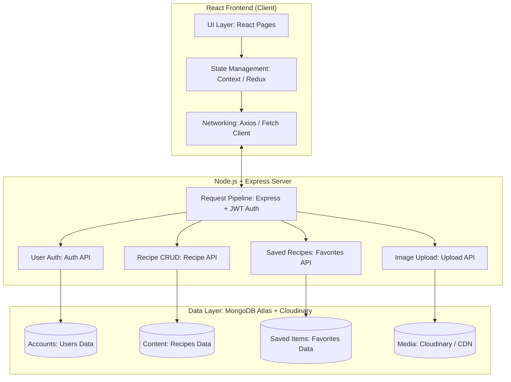
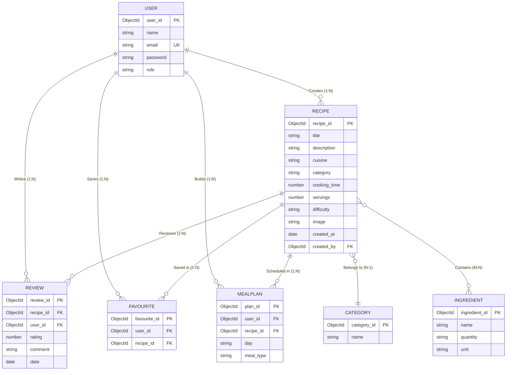
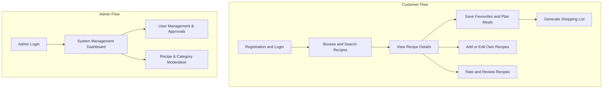
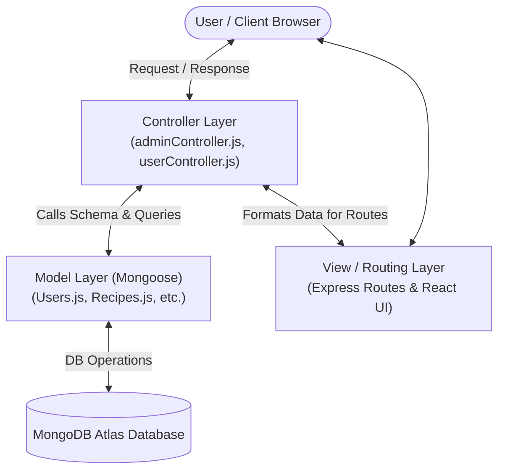

# Recipe Master – Recipe Management Platform
### Comprehensive Project Documentation

---

## 📌 Table of Contents
1. [Introduction](#introduction)
2. [Scenario-Based Case Study](#scenario-based-case-study)
3. [System Requirements](#system-requirements)
   - [Software Requirements](#1-software-requirements)
   - [Hardware Requirements](#2-hardware-requirements)
4. [Technical Architecture](#technical-architecture)
5. [ER Diagram & Data Model](#er-diagram)
   - [Entities](#1-entities)
   - [Relationships](#2-relationships)
   - [Keys](#3-keys)
6. [Key Features](#key-features)
7. [Roles and Responsibilities](#roles-and-responsibilities)
8. [User Flow & Flows](#user-flow)
   - [Customer Flow](#customer-flow)
   - [Admin Flow](#admin-flow)
9. [MVC Architectural Pattern](#mvc-pattern)
   - [Layers & Advantages](#advantages-of-using-mvc-in-this-project)
10. [Project Setup and Configuration](#project-setup-and-configuration)
11. [Backend Development](#backend-development)
    - [Backend Structure](#backend-structure)
    - [Backend Reference Video](#backend-reference-video)
12. [Database Development](#database-development)
    - [Database Connection](#create-database-connection)
    - [Schemas Implementation](#create-schemas)
13. [Frontend Development](#frontend-development)
    - [Folder Structure](#frontend-structure)
14. [Output Screenshots & UI Views](#output-screenshots)
15. [Demo Video and Code Links](#demo-video-and-code-links)

---

## Introduction

**Recipe Master** is a web-based recipe management platform that lets people create, organize, discover, and share recipes in one place. It replaces scattered notes, screenshots, and bookmarks with a searchable, structured recipe library.

Users can browse recipes by cuisine, diet, or cooking time, save favourites, build meal plans, and generate shopping lists from selected recipes. Contributors can upload their own recipes with photos, ingredient lists, step-by-step instructions, and nutrition details. Built-in ratings and reviews help the community find the best dishes.

The platform is built on the **MERN stack (MongoDB, Express.js, React.js, and Node.js)**. Secure authentication, image uploads, and a responsive interface make it suitable for home cooks, food bloggers, culinary students, and small catering businesses.

---

## Scenario-Based Case Study

### Meet Priya
Priya is a working professional who loves cooking but struggles to keep track of the recipes she finds online, in magazines, and from family. She wants one organized place to store them, plan weekly meals, and shop efficiently.

Priya discovers Recipe Master and decides to explore how it can simplify her kitchen routine:

* **User Registration and Authentication**: Priya creates an account with her name, email, and password, then logs in securely. Her recipes, favourites, and meal plans stay private to her account.
* **Recipe Catalog Management**: She browses a catalog of recipes with ingredients, quantities, preparation steps, cooking time, servings, and photos. Search and filters by cuisine, diet, ingredient, and cooking time help her find what she needs quickly.
* **Personal Recipe Collection**: Priya adds her grandmother's recipes with photos, edits them when she tweaks a dish, and saves recipes she likes to her favourites list.
* **Meal Planning and Shopping Lists**: She assigns recipes to days of the week and generates a combined shopping list of ingredients from her weekly plan.
* **Ratings and Reviews**: After cooking a dish, Priya rates it and leaves a review with tips, helping other users choose recipes.
* **Help and Support**: Guides, FAQs, and a contact option help her get the most out of the platform.

> **Priya's Experience**: With Recipe Master, Priya spends less time searching and more time cooking. Her recipes are organized, her meals are planned, and the platform has become an essential part of her kitchen.

---

## System Requirements

The tools below are needed to develop, test, and run the Recipe Master web application:

### 1. Software Requirements
* **Operating System**: Windows 10/11, macOS, or Linux for cross-platform development and testing.
* **Node.js (v16 or above)**: Runtime environment for server-side logic and API routing.
* **npm (v8 or above)**: Package manager for installing React and backend dependencies.
* **React.js**: JavaScript library for building the dynamic, responsive user interface.
* **Express.js**: Lightweight web framework for building RESTful APIs.
* **MongoDB**: NoSQL database storing users, recipes, ingredients, reviews, and meal plans.
* **Mongoose**: Object Data Modeling (ODM) library for MongoDB schemas and queries.
* **Browser**: Latest Google Chrome or Firefox for rendering and testing the UI.
* **Postman / Thunder Client**: Tool for testing APIs during development.
* **Visual Studio Code / Antigravity IDE**: Preferred code editor with built-in Git and terminal support.

### 2. Hardware Requirements

| Component | Minimum / Recommended | Purpose |
|---|---|---|
| **Processor** | Intel Core i5 (8th Gen) or AMD Ryzen 5 or better | Fast compilation and multitasking |
| **RAM** | 8 GB minimum, 16 GB recommended | Dev servers, IDE, and browser testing together |
| **Storage** | At least 1 GB free | Packages, MongoDB setup, and project files |
| **Display** | 1366 x 768 or higher | Comfortable coding and layout checks |

---

## Technical Architecture

Recipe Master uses a **three-tier client-server architecture**:



### Flow of Data:
1. The user interacts with the **Recipe Master frontend (React)** to browse, search, add, or review recipes.
2. The frontend sends HTTP requests to the **Recipe Master backend (Node.js and Express)**, which validates the request and applies business logic.
3. The backend reads and writes to the database (**MongoDB**) through Mongoose models. Users, recipes, ingredients, reviews, favourites, and meal plans are stored here.
4. The backend also uses a file storage layer to store uploaded recipe images.
5. Once the request is processed, the backend sends a JSON response to the frontend, which renders the result for the user.
6. Authentication is handled with **JSON Web Tokens (JWT)**, so protected routes such as adding a recipe or posting a review are only available to logged-in users.

---

## ER Diagram



### 1. Entities
* **User**: A registered person who browses, saves, and reviews recipes.  
  *Attributes*: `user ID`, `name`, `email`, `password`, `role`.
* **Recipe**: A dish with its details.  
  *Attributes*: `recipe ID`, `title`, `description`, `cuisine`, `category`, `cooking time`, `servings`, `difficulty`, `image`, `created date`.
* **Ingredient**: An item used in a recipe.  
  *Attributes*: `ingredient ID`, `name`, `quantity`, `unit`.
* **Review**: Feedback on a recipe.  
  *Attributes*: `review ID`, `rating`, `comment`, `date`.
* **Favourite**: A recipe saved by a user.  
  *Attributes*: `favourite ID`, `user ID`, `recipe ID`.
* **Meal Plan**: A weekly schedule of recipes.  
  *Attributes*: `plan ID`, `day`, `meal type`, `user ID`, `recipe ID`.
* **Category**: A grouping such as breakfast, dessert, or vegan.  
  *Attributes*: `category ID`, `name`.

### 2. Relationships

| Relationship | Cardinality | Meaning |
|---|---|---|
| **User creates Recipe** | 1 : N | One user can add many recipes |
| **Recipe contains Ingredient** | M : N | A recipe has many ingredients; an ingredient can appear in many recipes |
| **User writes Review** | 1 : N | One user can write many reviews |
| **Recipe receives Review** | 1 : N | One recipe can have many reviews |
| **User saves Favourite** | 1 : N | One user can save many favourite recipes |
| **User builds Meal Plan** | 1 : N | One user can have many meal plan entries |
| **Recipe belongs to Category** | N : 1 | Many recipes belong to one category |

### 3. Keys
* **Primary Keys**: Each entity has a unique ID that identifies each record (e.g. `_id` for Recipe, User).
* **Foreign Keys**: Link entities together (e.g. `Review` holds `userId` and `recipeId`; `Recipe` references `createdBy`).

---

## Key Features

* **User Registration and Profiles**: Create accounts, log in securely, and manage personal preferences.
* **Recipe Management**: Add, edit, and delete recipes with ingredients, steps, cooking time, servings, and images.
* **Search and Filters**: Instant search by title, ingredient, cuisine, diet, category, or cooking time, with dynamic sorting.
* **Favourites**: Save recipes to a personal collection for one-click access.
* **Meal Planning**: Assign recipes across Monday through Sunday for breakfast, lunch, and dinner.
* **Shopping List**: Automatically aggregate ingredients from planned meals into a unified checklist.
* **Ratings and Reviews**: Rate recipes from 1 to 5 stars and leave helpful cooking comments.
* **Image Uploads & Presets**: Attach photos to recipes to display them in the catalog.
* **Admin Dashboard**: Manage registered users, recipes, categories, and moderate community content.

---

## Roles and Responsibilities

### User
* **Registration & Account Management**: Create an account, maintain profile information, and keep credentials secure.
* **Recipe Search & Browsing**: Search and filter recipes by cuisine, dietary needs, ingredients, or time.
* **Recipe Contribution**: Add, edit, and maintain their own recipes with accurate measurements and photos.
* **Favourites & Meal Planning**: Organize personal collections and schedule weekly cooking routines.
* **Feedback & Reviews**: Share honest ratings and culinary tips.

### Admin
* **System Management**: Oversee platform health, monitor uptime, and safeguard data integrity.
* **User Management**: Manage accounts, including verification, suspension, or role assignment.
* **Content Moderation**: Review submitted recipes and reviews to ensure accuracy and community standards.
* **Category Management**: Create and maintain recipe categories, cuisine taxonomies, and tags.

---

## User Flow



---

## MVC Pattern

Recipe Master follows the **Model-View-Controller (MVC)** architectural pattern:



### Layer Breakdown
* **Model Layer (Data Layer)**: Handles data logic, schemas, and queries using Mongoose.
* **Controller Layer**: Sits between routes and models. Receives requests, executes validations, triggers model methods, and formats HTTP responses.
* **View Layer (Routing / UI Layer)**: Express routes define endpoint URLs and dispatch to controller functions; the React frontend presents the rendered views to the end user.

### Advantages of Using MVC in This Project:
* **Separation of Concerns**: Each tier has a distinct, isolated responsibility.
* **Scalability**: New endpoints and features can be added modularly without breaking existing code.
* **Reusability**: Controller and schema methods can be reused across different routes.
* **Testing**: Each layer can be tested and verified independently.
* **Collaboration-Friendly**: Multiple developers can work simultaneously across frontend, routes, and database models.

---

## Project Setup and Configuration

### Creating the Project Folder
1. Create a root directory named `RecipeMaster`.
2. Inside, organize the application into `client` (React frontend) and `server` or `api` (Express backend).

### Client Setup (React App)
```bash
# Initialize React client with Vite
npm create vite@latest . -- --template react
npm install
npm run dev
```

### Server Setup (Node.js & Express)
```bash
# Initialize Node.js backend
npm init -y
npm install express mongoose dotenv cors bcryptjs jsonwebtoken multer
```

---

## Backend Development

### Backend Reference Video
* **Video Walkthrough Link**: [Watch Backend Video](https://www.image2url.com/r2/default/videos/1790743867787-d6aaba79-e0ec-4e0e-ad61-1d416c17f764.mp4)

### Backend Structure
```
api/ (or server/)
├── data/
│   └── seedRecipes.js         # Seed catalog with ~800 recipes
├── models/
│   ├── Users.js               # Schema for user accounts
│   ├── Admins.js              # Schema for admin credentials
│   ├── Recipes.js             # Schema for recipe catalog
│   ├── Reviews.js             # Schema for ratings & reviews
│   ├── Favourites.js          # Schema for bookmarked recipes
│   └── MealPlan.js            # Schema for scheduled weekly meals
├── middleware/
│   ├── authMiddleware.js      # JWT authentication and role protection
│   └── upload.js              # Multer configuration for file uploads
├── controllers/
│   ├── userController.js      # User operations and recipe queries
│   └── adminController.js     # Admin operations and content moderation
├── routes/
│   ├── userRoutes.js          # Public & user endpoints
│   └── adminRoutes.js         # Admin management endpoints
├── index.js                   # Application entry point & serverless handler
└── package.json               # Backend dependencies and scripts
```

---

## Database Development

### Create Database Connection
```javascript
const mongoose = require('mongoose');
const dotenv = require('dotenv');
dotenv.config();

const connectDB = async () => {
  try {
    await mongoose.connect(process.env.MONGO_URI);
    console.log('MongoDB connected successfully');
  } catch (error) {
    console.error('Database connection error:', error.message);
    process.exit(1);
  }
};

module.exports = connectDB;
```

### Create Schemas

#### 1) Users.js
```javascript
const mongoose = require('mongoose');

const UserSchema = new mongoose.Schema({
  name: { type: String, required: true },
  email: { type: String, unique: true, required: true },
  password: { type: String, required: true },
  role: { type: String, default: 'user' }
}, { timestamps: true });

module.exports = mongoose.model('user', UserSchema);
```

#### 2) Recipes.js
```javascript
const mongoose = require('mongoose');

const RecipeSchema = new mongoose.Schema({
  title: { type: String, required: true },
  description: String,
  cuisine: String,
  category: String,
  cookingTime: Number,
  servings: Number,
  difficulty: { type: String, default: 'Medium' },
  ingredients: [{ name: String, quantity: String, unit: String }],
  steps: [String],
  image: String,
  createdBy: { type: mongoose.Schema.Types.ObjectId, ref: 'user' },
  createdAt: { type: Date, default: Date.now }
});

module.exports = mongoose.model('recipe', RecipeSchema);
```

#### 3) Reviews.js
```javascript
const mongoose = require('mongoose');

const ReviewSchema = new mongoose.Schema({
  recipeId: { type: mongoose.Schema.Types.ObjectId, ref: 'recipe', required: true },
  userId: { type: mongoose.Schema.Types.ObjectId, ref: 'user', required: true },
  rating: { type: Number, min: 1, max: 5, required: true },
  comment: String,
  date: { type: Date, default: Date.now }
});

module.exports = mongoose.model('review', ReviewSchema);
```

#### 4) Favourites.js
```javascript
const mongoose = require('mongoose');

const FavouriteSchema = new mongoose.Schema({
  userId: { type: mongoose.Schema.Types.ObjectId, ref: 'user', required: true },
  recipeId: { type: mongoose.Schema.Types.ObjectId, ref: 'recipe', required: true }
});

module.exports = mongoose.model('favourite', FavouriteSchema);
```

#### 5) MealPlan.js
```javascript
const mongoose = require('mongoose');

const MealPlanSchema = new mongoose.Schema({
  userId: { type: mongoose.Schema.Types.ObjectId, ref: 'user', required: true },
  recipeId: { type: mongoose.Schema.Types.ObjectId, ref: 'recipe', required: true },
  day: { type: String, required: true },
  mealType: { type: String, required: true }
});

module.exports = mongoose.model('mealplan', MealPlanSchema);
```

---

## Frontend Development

### Frontend Structure
```
src/
├── Admin/
│   ├── Alogin.jsx             # Admin login portal
│   ├── Asignup.jsx            # Admin onboarding
│   ├── Ahome.jsx              # Admin control overview
│   ├── Anavbar.jsx            # Admin navigation bar
│   ├── Users.jsx              # Registered users management
│   ├── Recipes.jsx            # Recipe moderation
│   ├── Categories.jsx         # Category & cuisine management
│   └── Reviews.jsx            # Review management
├── User/
│   ├── Ulogin.jsx             # User login
│   ├── Usignup.jsx            # User registration
│   ├── Uhome.jsx              # Main home feed with hero showcase
│   ├── Unavbar.jsx            # User navigation bar
│   ├── RecipeList.jsx         # Catalog browsing & filtering
│   ├── RecipeDetail.jsx       # Detail view with steps & timers
│   ├── AddRecipe.jsx          # Recipe creation & image upload
│   ├── MyRecipes.jsx          # User authored recipes
│   ├── Favourites.jsx         # Bookmarked recipe collection
│   ├── MealPlanner.jsx        # Weekly drag-and-drop meal planner
│   └── ShoppingList.jsx       # Automated consolidated grocery list
├── components/
│   ├── Footer.jsx             # Persistent site footer
│   ├── Home.jsx               # Landing page presentation
│   ├── RecipeCard.jsx         # Reusable recipe card item
│   ├── FilterBar.jsx          # Tag & query filters
│   └── FloatingTimer.jsx      # Interactive cooking timer widget
├── styles/
│   ├── EditorialRedesign.css  # Typography & theme rules
│   └── index.css              # Global styles & design tokens
├── App.jsx                    # Root state & view router
└── main.jsx                   # Vite entry mount point
```

---

## Output Screenshots

| View | Description |
|---|---|
| **Landing Page** | Editorial hero showcase featuring *"Know what you have. Cook what you can. Waste less."* with quick exploration links. |
| **Admin Registration** | Clean two-column onboarding layout for administrator accounts. |
| **Admin Login** | Secure sign-in form with email/password authentication. |
| **Admin Dashboard (Ahome)** | Profile metrics summary showing total recipes, favourites count, and scheduled meals. |
| **Admin Users Management** | MongoDB Atlas / admin view displaying registered user accounts and roles. |
| **Admin Recipes & Categories** | Structured catalog overview allowing content approval and category tag updates. |
| **User Sign In / Sign Up** | Visual culinary artwork alongside modern credential input fields. |
| **User Home & Recipe Details** | Featured dish banner (*Zemiakové Placky*), ingredients checklist, dynamic serving adjuster, and step-by-step instructions. |

---

## Demo Video and Code Links

* **Live GitHub Code Repository**: [https://github.com/vigass-tech/recipemaster](https://github.com/vigass-tech/recipemaster)
* **Demo Video Link**: [Watch Project Demo Video](https://drive.google.com/file/d/1sqVaimjlWNR3BNE3gP2JIIA6eGEMWjmX/view?usp=drive_link)
* **Backend Reference Video**: [Watch Backend Architecture Video](https://www.image2url.com/r2/default/videos/1790743867787-d6aaba79-e0ec-4e0e-ad61-1d416c17f764.mp4)
* **Live Deployment**: [https://recipemaster-ten.vercel.app](https://recipemaster-ten.vercel.app)
